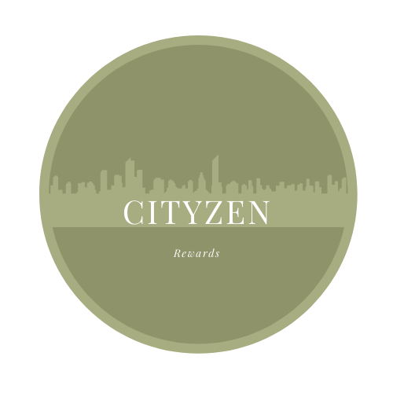

# What is CityZen?

CityZen was born out of [Startup Summer 2021](https://studententerprise.sheffield.ac.uk/blog/sheffield-startup-summer-how-to-create-your-own). 
The core idea was to find a way to gather information on an Amazon products' sutainability rating, relying on human input. 
This was to address the potential lack of awareness around a given item's sustainability rating when purchasing, the idea being that if consumers were aware of an item's sustainability rating, they would account for this when purchasing. 

